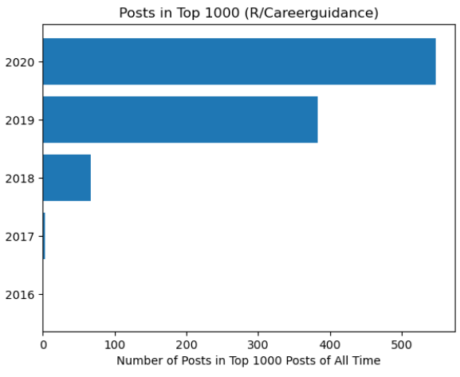
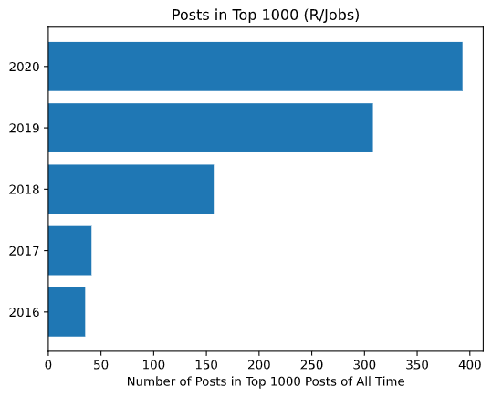

# Economic Changes and Frustrations in the US during the Coronavirus Pandemic:  A Story in Reddit Posts

# Introduction and Motivation
The arrival of COVID-19 to the United States, first seen in the horrific reports of cases spreading in nursing homes across the country in early 2020, along with a divided American leadership, helped lead to an economic crisis. 
In particular, the mismanagement and spread of the virus, along with the necessity to implement long-term social distancing measures, began a financial crisis for the service-based industry and its employees. As the day of the posting of this data story, December 26, 2020, there is no easy fix to this issue, since social distancing measures are necessary to stop the spread of the virus. 

### Motivation

As someone who has worked in all sorts of service roles in the past and recalling how many of my coworkers supported their families on an almost minimum wage income, this freezing of the service economy is especially worrisome. Furthermore, in states like Florida, physical unemployment benefit offices (the primary way Floridians apply for unemployment benefits) were shut down because of the pandemic; however, the online unemployment benefit application websites had been broken for years [source](https://www.tampabay.com/news/health/2020/03/31/ron-desantis-was-warned-about-floridas-broken-unemployment-website-last-year-audit-shows/). The reality of having absolutely no funds to pay rent or to buy food was very real for many Americans. 

Also, I am interested in investigating this trend since my hometown of Miami, Florida relies on a vibrant tourism industry to keep its economy healthy. I am concerned about the long term effects of residents of Miami being unable to find work, while receiving little financial support from the government. 

### Goal

**In this data story, I explore the story of this growing economic downturn through activity on job seeking advice forums on a popular social media site, Reddit.**

---

### Choice of Data Source and Data Acquisition Method:

The data was sourced from two popular job advice subreddits (forums) on Reddit.com, r/Jobs and r/Careerguidance. I chose these two forums since they are field agnostic. Other job advice forums seem to skew towards tech careers, and I wanted to focus on the impact to those in non-tech roles. 

I chose the social media site Reddit since it is free to make an account, and it has been around for fifteen years. Also, just under 30 million Americans are on Reddit; the user base skews towards Americans. 

I scraped the Top 1000 posts of all time from the target forums, where “top” status is determined by number of upvotes. Therefore, the Top 1000 posts data for R/Jobs is a record of the top thousand most liked posts since the inception of the forum in 2008. 

The scraping itself was done using PRAW, a Python Reddit API wrapper [documentation]( https://praw.readthedocs.io/en/latest/). The results of the data cleaning can be found in the `data` folder, as well as the `data_analysis` folder. The full data are in the form of .csv’s in the ‘data’ folder, for the interested reader. 

# Questions and Analysis

## Landscape of Top 1000 Posts:

First, I wanted to answer the question: 

**Did Activity In these subreddits go up in the months surrounding the spread of COVID-19 to the US?**

### An Interesting Pattern from R/Careerguidance:

The answer to the question was *yes* in the first subreddit. 

2020 dominated the landscape of the top 1000 posts of all time in R/Careerguidance. In fact, we have that a whopping *547* of the posts in the Top 1000 list (so the majority by many standards) were from 2020! Only *383* were from 2019, *67* were from 2018, and *3* were from 2017. 2016 saw no share in the Top 1000. 

This figure illustrates this disparity in popularity of the posts between years:

This fact is particularly impressive considering that the top 1000 group consists of the top 1000 posts of all time since the inception of the subreddit, which was in *2011*!

To me, this means that 2020 saw more user engagement or a form of user "agreement" than any other year. "Likes" and "upvotes" are, after all, a way for someone to agree with the sentiment of a post. The Top 1000 list keeps track of record numbers of these "upvotes". 

I would really like to attribute 2020's overrepresentation in the data to the spread of the Coronavirus in the US and its disastrous effects on employment, but we can't be sure without carrying out some more precise statistical tests. Furthermore, we can't truly attribute causation without experimental data. 

### **Another Interesting Result from R/Jobs**:

Doing the same analysis for r/Jobs, I found that the 2020 presence wasn't as strong in the Top 1000 posts of all time as it was on R/Careerguidance. However, 2020 still appeared more in the Top 1000 list than any other year. The answer to the research question was still a *yes*. 

In fact, *393* of the posts in the Top 1000 were from 2020, *308* were from 2019, *157* were from 2018, *41* were from 2017, and *35* were from 2016. 

This figure illustrates this disparity in popularity of the posts between years on r/Jobs:

This is still impressive, considering that 2020 isn't even over yet. The fact that 2020 took a larger share of the Top 1000 posts than any other year since the forum's creation in *2008* also compels me believe that this year saw a huge spike in user engagement on job-seeking advice forums. 

### February, March, and April 2020 in R/CareerGuidance

In order to investigate whether there was a spike in activity and engagement after the arrival of the Coronavirus to the US, I wanted to focus on key statistics from the months that suffered the initial shock of COVID-19. To do this, I separated the Top 1000 posts list into months from 2020, and the results are listed in the table below. February acts as the "control" month, since the coronavirus was initially confirmed to be a threat in the US closer to March. It is clear that after the economic effects of the virus first began in March and April, a few key statistics start to trend upwards. 

| Statistic in R/Careerguidance   | February Posts | March Posts | April Posts |--Top 1000 Form Posts of All Time--}
| ----------- | ----------- | ----------- | ------------ |------------|
| Number of Posts  | 38 | 50   |  44  | 1000 |
| Average Post Score | 207 | 267.42*| 245.70* | 208.5 | 
| Average Number of Comments| 80.74 | 99.98* |84.73| 77.01* |
| Highest Number of Comments on Post | 300 | 457* |310 | 579 |
| Highest Post Score | 675 | 772 |1250 | 1484 |

It's clear that the average post scores in March and April were much higher than the average post scores in the Top 1000 and in February (267.42 and 245.7 points compared to 208.5 points and 207 points). Then, more users "agreed" with the sentiment of posts in March and April, since scores record the number of upvotes. 

Indeed, another important statistic trended upwards in the critical months of March and April. The average number of comments in March and April were *99.84* and *84/73*, respectively, compared to *80.74* in February and *77.01* in the Top 1000. A higher average number of comments on a post indicates a higher level of user engagement with a post. From this pattern, it seems that a lot more users were involved with the posts in the critical months after the beginning of the economic fallout of the pandemic. 

Notice that while this rise in engagement could possibly be attributed to the fact more people were online thanks to the social distancing measures, these are job seeking advice forums, so I would like to think that the rise in engagement was correlated with the start of the economic crisis. Of course, to establish correlation we need to calculate a correlation. 

### April 2020 in R/CareerGuidance

From the table above, we see that an important statistic in April was the record top scoring post, which was much higher than in the previous months (*1250* compared to *675* in February and *772* in March).

Let's look at the contents of this record post:

We find that this post with a score of 1250 in r/careerguidance was directly related to losing your job during the coronavirus pandemic:   
  -  > "Are you seriously trying to quit your job during a global pandemic and impending recession? o_O
  -  >  (Advice) This will probably be downvoted to hell. That’s okay. But really, there has been an uptick in people posting about quitting their jobs. This isn’t to berate you. If you aren’t happy, you really should find a way to leave. ...Where I am, the depression from the lockdown restrictions alone has led to a rise in suicides. Quitting your job and then finding yourself in the cold may put you in a worse off position. This is sounding harsh but it is coming from a good place. Things are going to work out. We just don’t know when. In the meantime, hang in there. Take this global lockdown time to plan your exit meticulously, save up and start skilling up for the jump. Good luck! o_O" [source](https://www.reddit.com/r/careerguidance/comments/g4d70n/are_you_seriously_trying_to_quit_your_job_during/)
  
From the fact this was upvoted so many times, I'd say we can see that users began feeling anxiety regarding quitting or losing their jobs during the pandemic. The coronavirus started to gain status as an economic threat in addition to its status as a health threat.

An interesting thing to note is that this post is actually the second highest scoring post on the forum from all time, second only to a post from 2019. 

For control purposes (as close as we can get to a control), let's look at the post with the highest number of comments in February: 

- > "Do you wished you had done some job shadowing before declaring your major in college?"[source](https://www.reddit.com/r/careerguidance/comments/f4wjvk/do_you_wished_you_had_done_some_job_shadowing/)

The highest scoring post in Februrary is a question regarding job shadowing and not at all concerned with the coronavirus pandemic. There's still not a focus on job searching during the pandemic. 

Let's also investigate the highest scoring post from March in R/Careerguidance. March was almost too soon to see the full extent of massive layoffs and resciended job offers. 
- >  "I was rejected from a position that required a high school diploma when I have a bachelor's. How am I supposed to properly handle how pathetic I feel right now?" [source](https://www.reddit.com/r/careerguidance/comments/fitp9r/i_was_rejected_from_a_position_that_required_a/)

This post is concered with rejection from a job, and never mentions the Coronavirus as a reason for the rejection. 

From this pattern, we see engagement rise when the top posts concern the pandemic,(April's top post had about 500 points more than previous months' top posts) a health and economic threat every user was feeling. 

## Another Question:

I also wanted to investigate:

**What is the overall type of posts on these subreddits, both before and after the start of the economic downturn (start of the "Lockdown")? Was there a change in the type of subjects discussed?**

## *Language Landscape* of Posts Before March 2020:
1. What were the most popular types of posts before th onset of the pandemic? Which were the most popular types of posts after the onset?
    - INSERT TOP 5 SCORES FROM COVID DF FOR RJOBS VS TOP 5 SCORED FROM NON COVID DF FOR R JOBS
    - HIGHLIGHT THE TOP 5 POSTS FROM EACH in bar plot
    - From this, you can see that the focus started to shift onto digital job tools (LinkedIn, Glassdoor) and feelings regarding those tools.
    - During this time, we also see a rise in users complaining about not being able to find work, despite their best efforts:

    - take a look at the titles for May 2020's top 5 highest scoring posts

### Language of February 2020 in R/Careerguidance and R/Jobs:

In order to investigate the "language landscape" of the most popular jobs just before the start of the pandemic, let's look at the titles of the top five posts from February in both subreddits:

| R/Jobs | R/Careerguidance | Rank |
| --------|-----------------|-------|
| Thanks r/jobs, I'm surprised this actually worked. Phone Interview: "What payment compensation do you want to receive while working here?" Me: "I would like to be compensated fairly based off my responsibilities, what do you suggest?" "Well our range is $___ to $___"|Do you wished you had done some job shadowing before declaring your major in college? | 1 |
|We Need To Openly Talk About The Mental And Emotional Anguish Faced By Job Seekers | I found my coworkers have a secret group chat where they slander my name or chat about me. What should I do?| 2|
|Finally offered a job after using this sub & 134 job applications later...here's what I learned. | Is there more to life than a 9-5, 40-hour work week?| 3|
| My 16-month job search has come to an end| How important to you is it to have a good boss?| 4|
|Is employer interviewing then ghosting just the norm now? |Only work about 3 actual hours per day (non salaried) and boss is non the wiser and thinks I do good work. Should I tell her the reality? | 5|

These top posts serve as our "control". The "rank" column refers to the posts's place in top scoring posts for that month. While I expected these posts to be a bit more optimisitic, I found that the language of R/Jobs is still bleak, suggesting that posts on R/jobs had a baseline "bleakness" to them. 

### Language of March 2020 in R/Careerguidance and R/Jobs:
| R/Jobs | R/Careerguidance | Rank |
| --------|-----------------|-------|
| There should be some kind of regulation where job postings must include the pay and physical work address|Anyone feel depressed after being on LinkedIn? |1 |
|I really am an essential employee and I'm quitting. How do I make this less painful?|Did Covid-19 put a halt on your job search ? Join the club. |2 |
|How do you deal with the guilt that comes along with trying to enjoy yourself while being unemployed?| Interviewer berated me because of a misspelled word on my resume, they were incorrect. How should I have handled this situation?|3 |
| Had a Job Interview cancelled due to Coronavirus in the area. What do I say to the employer?| Anyone else get annoyed with LinkedIn? (Rant)| 4|
|Just received a job offer. . . I've never been less excited.| Has the COVID-19 response delayed anyone else's career path?| 5|

### Language of April 2020 in R/Careerguidance and R/Jobs:

- > "April is the cruelest month" -T.S Eliot

| R/Jobs | R/Careerguidance | Rank |
| --------|-----------------|-------|
|Why Do Nearly All Entry-Level Jobs Require Unrealistic Amounts of Experience or Certifications?| Are you seriously trying to quit your job during a global pandemic and impending recession? o_O| 1|
| Has anyone actually stopped caring about a position/company before because they have the most outrageous interviewing processes or do things that are just weird/bad? I know this isnt even related to my job function but sometimes this stuff is just too much.| Do you feel like COVID-19 is going to change the workforce permanently?| 2|
| Got my first Interview Ever!!!|What are some niche careers that while not that widely known, you think people should be aware of? | 3|
| I'm 29 and I've been unemployed for 1.5 years because I wanted to. What do I say on my next interview?|My company keeps forcing everyone to do social activities on webcam as a means of overcompensating for the fact that we're working from home. I'm really not a fan of this. What should I do? | 4|
| Would you work 13 hours a day 3 day a week?|Hello Millenials. I'm graduating university next year into the recession/depression, and I'm terrified. How did you survive the 2009 recession and its aftermath? | 5|

### Language of May 2020 in R/Careerguidance and R/Jobs:

| R/Jobs | R/Careerguidance | Rank |
| --------|-----------------|-------|
| Does anyone else find LinkedIn toxic?|Anyone else graduated, got in a 'career' and realise there was more to life than work? | 1|
| How will I ever go back to an office?|Is there no place for employees that are just pretty good at their jobs | 2|
|I'm going to a job interview in 2 hours -- do I wear a mask?? |How do I get over my deep-seated dislike of working? | 3|
| I was laid off due to COVID-19 on March 20th. Was told my position was eliminated. Today, I just found out that my previous job was listed online a week ago as open and is accepting applications.|It's no longer enough to do your job, but you have to be above and beyond to keep it | 4|
|Has "faking it till you make it" gone too far?| Lost in job hunt and life, what the hell do I do now| 5|

- Interpretation:
- these are posts with a bleak interpretation of work,
- Let's compare this to the top five posts from r/jobs from May:
- 
These tables paint a bleak picture of the state of the worker in America, both in service and non-service based roles.

# Summary + Possible Limitations of My Analysis

Summary: I found increased activity in the form of both user engagement (comments) and user "agreement" (likes/upvotes) in two very popular job seeking advice forums, aimed to all industries and in particular to people in service roles in the US. Furthermore, the tone of the most popular posts became more bleak, and several reffered to the fear of losing their jobs during the pandemic. 

1. One social media site is not a faithful representation of the entire country, but drastic changes online might signal drastic changes in the US economic landscape.
2. people who are doing well are not going to be posting on the internet about their struggles, so perhaps there is a bias here towards people who are feeling left out of the job finding process. 
3. stuff that scores high on social media isnt necesarily the real world, usually the bleaker, pessimistic stuff scores higher than serene posts. 